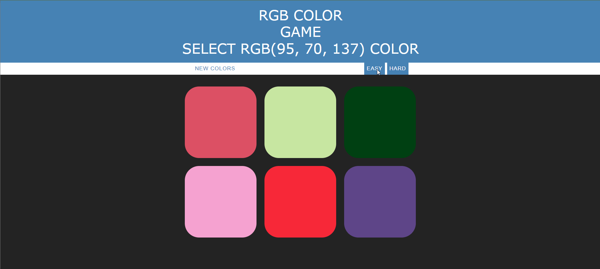

## RGB Color Guessing Game
A web app game based on JS. Created for the purpose of learning and it was a part of the web developer bootcamp by the colt steele on the udemy.

### Tech Stack Used
- HTML
- CSS
- JavaScript

### Mode Available : 2
- [X]  Easy : 3 Color Box 
- [X]  Hard : 6 Color Box

Default mode is hard where user have to select the right color from 6 color box 

### Available Functionalities 
- [X]  Two Game Mode : Easy and Hard
- [X]  Provides new colors on cliking of new colors button
- [X]  Wrong Choice in the game will make that color disappear and display the message stating "Try Again"
- [X]  Guessing the right color will change all color boxes to the right one and display the message stating "Correct" 

### How to Play
- Random RGB color will be displayed, ex: RGB(58, 82, 207)
- Depending on the mode that user selected, they have to guess the color from the displayed color boxes.
- In case of wrong color choice that perticular box will disappear.
- now users have to select the right color from the remaining ones untill they find the right one.

### Demo

Gif - RGB Color Guessing Game

 

Image 1 - Hard Mode

 

Image 2 - Easy Mode

 

Image 3 - Wrong Choice

 

Image 4 - Correct Choice

 

Image 5 - Mobile view

 
